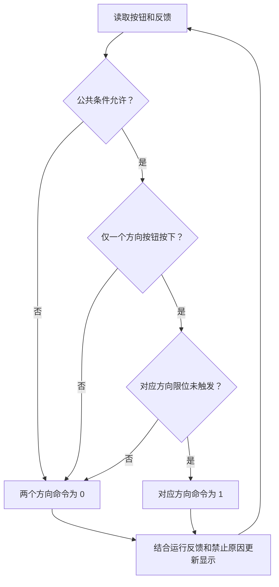

# 简化行车起升机构 I/O 与状态链路

学习日期：2026-09-21

## 1. 模型范围

本文件使用虚构的起升机构，描述上升、下降两个方向的输入、
输出、运行条件和状态反馈，不使用公司资料或实际 PLC 地址。

采用按住运行、松开停止的操作方式，不使用运行自锁。
这是学习用逻辑模型，不作为现场控制方案。

未包含制动器控制、变频器时序、换向停稳确认及完整安全控制。
急停由独立的安全系统处理，普通程序读取安全回路反馈，
不能用本文件中的布尔判断代替安全功能。

## 2. 输入信号

以下为逻辑含义，不直接代表实物触点的接线电平。

| 变量名 | 类型 | 含义 | 为 1 时表示 |
|---|---|---|---|
| upPressed | DI | 上升按钮 | 操作员按住上升按钮 |
| downPressed | DI | 下降按钮 | 操作员按住下降按钮 |
| upperLimitActive | DI | 上限位反馈 | 已到达上限位 |
| lowerLimitActive | DI | 下限位反馈 | 已到达下限位 |
| safetyReady | DI | 安全回路允许反馈 | 安全回路允许运行 |
| driveFault | DI | 驱动器故障反馈 | 驱动器存在故障 |
| driveRunning | DI | 驱动器运行反馈 | 驱动器报告正在运行 |

仅凭 safetyReady = 0，不能认定有人按下急停，
只能说明安全回路未就绪。明确显示急停原因需要对应反馈。

## 3. 输出与内部变量

| 变量名 | 类型 | 含义 | 为 1 时表示 |
|---|---|---|---|
| upCommand | DO 对应命令 | 上升运行命令 | 程序请求驱动器上升运行 |
| downCommand | DO 对应命令 | 下降运行命令 | 程序请求驱动器下降运行 |
| faultLamp | DO 对应命令 | 驱动器故障指示灯 | 点亮驱动器故障指示灯 |
| commonReady | 内部变量 | 公共运行条件 | 安全回路允许且驱动器无故障 |

commonReady 由输入计算得出，不占用物理 I/O 点。
本模型约定 faultLamp 仅指示 driveFault，不用于概括所有禁止原因。

## 4. 运行条件

以下使用 C++ 布尔表达式描述逻辑，不是完整 PLC 程序。
每轮计算使用同一轮输入，先计算公共条件，再计算输出命令。

```cpp
bool commonReady = safetyReady && !driveFault;

bool upCommand = commonReady
                 && upPressed
                 && !downPressed
                 && !upperLimitActive;

bool downCommand = commonReady
                   && downPressed
                   && !upPressed
                   && !lowerLimitActive;

bool faultLamp = driveFault;
```

规则：

- 上限位触发：禁止上升，其他条件正常时允许下降。
- 下限位触发：禁止下降，其他条件正常时允许上升。
- 两个方向按钮同时按下：两个方向命令均为 0。
- 松开方向按钮：对应运行命令变为 0。
- 安全回路不允许或驱动器存在故障：两个方向命令均为 0。
- 上下限位同时触发：两个方向均被禁止，需要排查信号。
- 上述逻辑只处理当前条件，未实现故障恢复后的重新启动确认。
  若按钮持续按住，条件恢复后表达式可能重新输出运行命令。

## 5. 请求、命令与反馈的区别

| 层次 | 示例 | 能说明什么 |
|---|---|---|
| 操作请求 | upPressed = 1 | 操作员希望上升 |
| 输出命令 | upCommand = 1 | 程序判断允许并发出上升命令 |
| 运行反馈 | driveRunning = 1 | 驱动器报告运行 |

按钮请求为 1，不代表最终输出命令一定为 1。
输出命令为 1，也不代表机构已经运动。

driveRunning 不能单独确认运动方向，也不能证明吊钩实际移动。

显示原则：

- 有命令、无运行反馈：显示“已发出命令，运行尚未确认”。
- 有运行反馈：显示“驱动器报告运行”，方向命令单独显示。
- 无命令、有运行反馈：显示“命令已撤销，驱动器仍报告运行”。
- 无命令、无运行反馈：显示“无运行命令，驱动器未报告运行”。
- 驱动器故障：明确提示驱动器故障。
- 安全回路未就绪：明确提示安全回路未就绪。
- 多个禁止条件同时存在时，应分别记录原因。
- 输出命令变为 0，不等于确认机械机构已停止。

## 6. 状态链路图



运行反馈与命令分别采集、分别判断。
没有输出命令时，也需要继续关注驱动器反馈。

## 7. 逻辑推演记录

下表未特别说明的条件均正常。
输出顺序为 upCommand、downCommand。

| 场景 | 预期输出 | 原因 |
|---|---|---|
| 两个按钮均未按下 | 0、0 | 无操作请求 |
| 只按上升，未到上限位 | 1、0 | 上升条件满足 |
| 只按下降，未到下限位 | 0、1 | 下降条件满足 |
| 同时按住两个按钮 | 0、0 | 双按钮互锁 |
| 上限位触发，只按上升 | 0、0 | 上升被限位禁止 |
| 上限位触发，只按下降 | 0、1 | 允许下降离开上限位 |
| 下限位触发，只按下降 | 0、0 | 下降被限位禁止 |
| 下限位触发，只按上升 | 1、0 | 允许上升离开下限位 |
| safetyReady = 0，按任意方向 | 0、0 | 安全回路不允许 |
| driveFault = 1，按任意方向 | 0、0 | 驱动器故障 |
| 两个限位同时触发 | 0、0 | 两方向均被限位禁止 |

以上是纸面逻辑推演，尚未进行 PLC 软件仿真或硬件验证。

## 8. 本次学习结论

- DI 是输入反馈，DO 是输出控制，内部变量保存计算结果。
- 限位分别限制对应方向，公共条件影响两个方向。
- 操作请求、输出命令、设备反馈不能混为一谈。
- 界面应显示实际反馈及禁止原因，不能根据命令直接猜测设备状态。